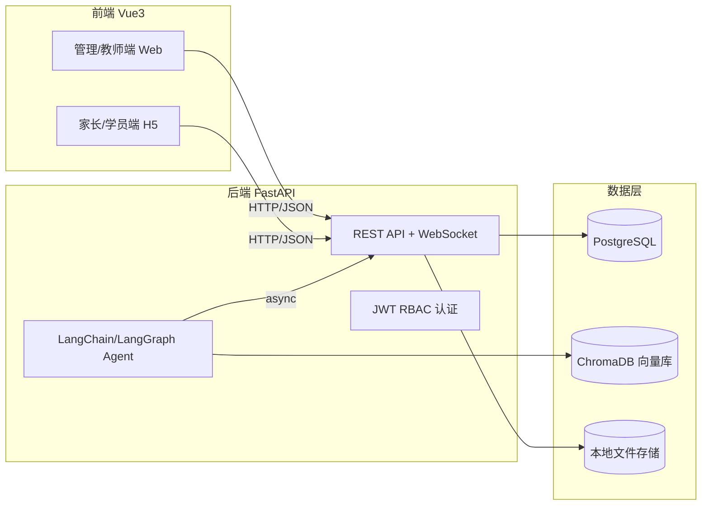

# 系统设计文档

> M0 阶段（基础设施与认证）开始填充；随开发持续更新。本文件由 PRD（docs/prd/PRD.md）驱动。

## 变更记录

| 版本 | 日期 | 说明 |
| --- | --- | --- |
| v0.1.0 | 2026-08-28 | M0 基础设施与认证：确立架构、目录、认证方案 |
| v0.2.0 | 2026-08-29 | M1 学员与班级：数据模型、学员/班级/课时包/课时流水/催缴名单 API |
| v0.3.0 | 2026-08-29 | M2 排课与划课时：排课（跨教师冲突检测）、考勤、扣课时；前端设计系统升级 |
| v0.3.1 | 2026-08-29 | M2 补强：教师管理（校区标签/CRUD/搜索）、考勤时间窗拦截、班级搜索、催缴跟进状态 |
| v0.4.0 | 2026-08-30 | M2 补强2：列表统一分页、学员停课/恢复在读（含备注）、催缴续费（课包/自定义）、排课按校区筛选、侧边栏收起/独立滚动 |
| v0.5.0 | 2026-08-30 | M3 课后反馈首轮：feedbacks 表、幂等创建/编辑/发布/AI 草稿预留、本地素材上传（OQ-04=本地磁盘）、前端反馈页 |
| v0.5.1 | 2026-08-30 | M3 课后反馈增强：仅已完成排课进反馈+进度徽标、请假学员免反馈、多条件筛选+统计卡、课题内容字段、批量填入弹窗化 |
| v0.5.2 | 2026-08-30 | M3 AI 草稿接入真实 LLM（FR-FB-03）：`app/services/llm.py` LangChain 服务层（DeepSeek 可切换）+ `ai-enhance` 真实生成草稿写 `ai_draft` + 前端「AI 草稿」按钮回填，未配 Key 优雅降级 |
| v0.5.3 | 2026-08-30 | M3 反馈增强2：新增「课堂评价」字段（AI 内容写入位置）+ 提示词模板系统（系统内置 3 套/个人自定义账号隔离/管理员发布全校共享）+ AI 生成弹窗选模板 + 未保存自动保存引导 |
| v0.6.0 | 2026-08-31 | M3 反馈回顾轮：修复 AI 课堂评价 500（`title` 参数契约错位）+ 统一操作按钮图标 13px + 已反馈口径收窄为「仅已发送」并新增「重新编辑/撤回」重发链路（反馈/日报周报皆支持） |
| v0.6.1 | 2026-08-31 | M3 报告（日报/周报）：`reports` 表（幂等创建/唯一约束 draft↔published）+ 日报富文本模板 + 周报统计自动计算（上课人次/出勤率/缺课人次/缺课学员/新增学员）+ AI 草稿（基于排课/考勤与日报摘要）+ 历史归档检索 + 前端日报/周报双 Tab 页面 |
| v0.7.0 | 2026-08-31 | M3 季度/年度总结（PPT）：`reports` 扩展 `quarterly/yearly` 类型 + `ppt_url` 列（迁移 c0ffee000004）+ 周期聚合统计 `period-stats/preview` + AI 季度/年度总结（`generate_period_summary`，素材=周期周报摘要）+ python-pptx 生成 16:9 简报 `uploads/ppt/` + 前端「总结·PPT」页（季度/年度 Tab、统计卡、AI/生成 PPT/下载/提交/撤回） |
| v0.7.1 | 2026-08-31 | M3 公栏与图表：教师管理教师只读（列表可见、写操作 403+前端提示弹窗）；报告公栏（已发布统一展示+校区/教师/类型/日期筛选+分页+按在职教师统计应/已提交）；期间统计补 当前学员/应耗课时/消耗课时/达标率（缺课学员回日报）；月度折线图（应耗/消耗课时/新增学员/上课人次）+ 期间对比柱状图（季度同上季、年度对上年）+ PPT 公栏（仅看自己可编辑）+ echarts |
| v0.8.0 | 2026-09-01 | M4 AI 习题：assignments/questions/submissions 三表（迁移 c0ffee000005）+ AI 出题（举一反三/作业模式/对话优化）+ 作业 CRUD/发布/撤回 + 题目管理（追加/编辑/删除/排序）+ 前端「AI 习题」页（每题一页+题号导航+答案折叠+题型切换+用例编辑+文档下载），OQ-03=仅录入用例，判题引擎 M5 |
| v0.8.1 | 2026-09-02 | M4 补强：历史题目池（已发布作业题目跨教师复用，作业标题/题型多选/难度区间筛选+分页）+ 发布弹窗班级复选框对齐/间距修复；后端以 --reload 运行 |
| v0.9.0 | 2026-09-03 | M5 客户端：notifications 表 + students.student_user_id（迁移 c0ffee000007/000008）+ `/api/client` 家长/学员端（课时/反馈/课表/课时包/订单/作业/作答）+ 判题引擎（客观题自动判，OQ-03）+ 模拟支付订阅（订单管理员确认到账，OQ-06）+ 提醒通知（上课前一天/低课时，惰性幂等）+ 教师批改（submissions）+ 前端 ClientLayout 客户端 H5（首页/作业作答/反馈/订阅/订单/通知）|

---

## 1. 总体架构



**约束**

- 前后端分离，API 统一 `/api` 前缀；
- AI 能力全部通过后端 LangChain/LangGraph 服务暴露，前端不直接调用模型；
- 所有"生成类"功能必须走 `草稿 → 审核 → 发布`，AI 结果不允许直发家长端；
- 认证采用 JWT + RBAC（Role-Based Access Control）。

## 2. 目录结构

```
backend/
  app/
    main.py            # FastAPI 入口
    core/
      config.py        # 配置（pydantic-settings）
      security.py      # JWT / 密码哈希
      database.py      # SQLAlchemy engine/session
    models/            # SQLAlchemy 模型
      base.py
      user.py          # 用户
    schemas/           # Pydantic 校验模型
      auth.py
    crud/              # 数据访问层
      user.py
    api/
      deps.py          # 依赖（当前用户/权限）
      routers/
        auth.py        # 登录/注册/当前用户
    utils/             # 通用工具
  alembic/             # 数据库迁移
  requirements.txt     # 依赖清单
  pyproject.toml       # uv 依赖管理
  .env.example         # 环境变量模板
  README.md            # 安装/运行指引
frontend/
  src/
    api/               # axios 客户端
    stores/            # Pinia
    router/            # 路由
    views/             # 页面
  package.json
  vite.config.ts
  ...
```

> 前端目录在 M0 建骨架，完整组件随对应里程碑推进。

## 3. 技术选型决策

| 决策点 | 结论 | 理由 |
| --- | --- | --- |
| 后端框架 | FastAPI | 异步、类型校验（Pydantic）、自动 OpenAPI 文档，契合 AI 异步任务 |
| ORM | SQLAlchemy 2.x + Alembic | 成熟、与 FastAPI 生态契合，迁移可追踪 |
| 配置管理 | pydantic-settings + .env | 环境隔离、模型可配置（LLM） |
| 认证 | JWT（Bearer Token）短期 + 刷新令牌 | 前后端分离标准方案，RBAC 基于角色字段 |
| 密码存储 | bcrypt（passlib/pwdlib） | 安全哈希 |
| 角色模型 | 单表 `role` 枚举字段 | 角色固定（admin/staff/teacher/parent/student），后期可扩展为角色表 |
| 前端 | Vue 3 + Vite + TS + Pinia + Vue Router | 现代、可维护、类型安全 |
| 数据库 | PostgreSQL / SQLAlchemy | 初始表随 M1 建立 |
| 虚拟环境 | uv | 依赖安装需科学上网，提供 pyproject.toml 与命令 |

## 4. 认证与授权设计

### 4.1 角色枚举

```python
class Role(str, enum.Enum):
    ADMIN   = "admin"    # 高权限管理员
    STAFF   = "staff"    # 教务
    TEACHER = "teacher"  # 教师
    PARENT  = "parent"   # 家长
    STUDENT = "student"  # 学员
```

### 4.2 令牌策略

- 访问令牌（access）：有效期默认 30 分钟，Header `Authorization: Bearer <token>`；
- 刷新令牌（refresh）：有效期默认 7 天，用于换取新访问令牌；
- 都通过 JWT 签名（HS256，密钥来自环境变量）。

### 4.3 RBAC 依赖

- `get_current_user`：从 Bearer 解出 user_id → 查库 → 注入当前用户；
- `require_roles(Role, ...)`：校验当前用户角色是否在允许集合内，否则 403。

### 4.4 密码

- bcrypt 哈希存储，登录校验 `verify_password`；
- 注册接口默认按角色创建（仅允许 admin/teacher/parent/student 前端注册，staff 由管理员创建）。

## 5. 数据模型（M0 + M1 已实现）

> 枚举统一使用 `enum.StrEnum`（值小写字符串）+ SQLAlchemy `Enum(..., native_enum=False)`，兼容跨库。

### 5.1 用户（User）— M0

| 字段 | 类型 | 说明 |
| --- | --- | --- |
| id | UUID PK | 主键 |
| role | varchar(16) | 角色（4.1） |
| username | varchar(64) unique | 登录名 |
| phone | varchar(20) unique nullable | 手机号 |
| name | varchar(64) | 显示名 |
| password_hash | varchar(255) | bcrypt 哈希 |
| status | varchar(16) active/disabled | 账号状态 |
| created_at / updated_at | datetime | 审计 |

### 5.2 学员/班级/课时（M1，`app/models/enrollment.py`）

| 实体 | 关键字段 | 说明 |
| --- | --- | --- |
| Student | id, name, phone, parent_user_id(FK user,可空,M5绑定), **lesson_balance**, status(active/archived) | 学员，课时余额冗余字段（每次变更经由流水） |
| Class | id, name, subject, teacher_id(FK user 可空), start_date, status | 班级（科目 + 带教教师） |
| StudentClass | student_id, class_id (复合PK, 唯一约束) | 学员-班级多对多；学员可跨班 |
| LessonPackage | id, name, price(Numeric), total_lessons, cover_image, status(active/inactive) | 课时包 |
| LessonRecord | id, student_id, record_type(recharge/consume/adjust), **delta(+入/-扣)**, **balance_after**, ref_id(排课/订单,M2/M5), remark, operator_id | 课时流水：记录快照余额 |
| Order | id, student_id, package_id, amount, status(pending/paid/confirmed/cancelled/refunded), paid_at, confirmed_at | 课时订单（M5 模拟支付用） |

**课时余额规则（重要）**

- 学员当前课时 = `Student.lesson_balance`，任何变动必须同时写 `LessonRecord`（同事务）记录 delta 与变动后余额，可回溯；
- 每次上课扣减 2 课时（`CONSUME`，M2 划课时触发）；充值/人工调整为 `RECHARGE`/`ADJUST`；
- **课时 ≤ 10 → 爆红 + 进入催缴名单**（`low_balance` 查询条件）；
- 负数扣减禁止使余额 < 0；
- 删除学员/班级为**软删除**（status=archived），历史反馈/流水保留。

### 5.3 软删除

| 实体 | 机制 |
| --- | --- |
| Student / Class | status 置 `archived`，查询默认排除 |

### 5.4 排课/考勤（M2，`app/models/schedule.py`）

| 实体 | 关键字段 | 说明 |
| --- | --- | --- |
| Schedule | id, class_id(FK), teacher_id(FK), **start_time/end_time**, status(scheduled/completed/cancelled) | 排课（90 分钟/节） |
| Attendance | id, schedule_id, student_id, status(unmarked/attended/leave), operator_id, **唯一约束(schedule_id, student_id)** | 考勤记录（防重） |

**排课冲突规则（OQ-05 已确认，2026-08-30 细化）**

- **同一教师冲突检测**：只有【同一教师】的排课在 `[start, end)` 时间段重叠才算冲突（任意班级）；不同教师可同时段分别开班
- 互相冲突的课程不允许同时排出来（除非 `force=true`，前端弹出确认）
- 创建/改期/循环排课均执行检测（排除自身、排除已取消）
- 取消排课为状态置 `cancelled`（保留历史，不再参与冲突检测）

**循环排课（M2 补充）**

- `POST /schedules/recurring`：每周 N 节（多时间段）× 连续周，直到排满 `total_lessons` 节
- 时间段 `weekday`（1=周一…7=周日）+ `start_time`（HH:MM 本地时间）+ `duration_min`
- 从 `start_date` 所在周开始，按周推进；批次内部与既有排课统一做同教师冲突检测

**考勤与划课时规则（重要）**

- 考勤批次接口自动为班级学员建 Attendance 行（`uq_schedule_student` 防重）
- 「已到」→ 扣 2 课时（写 `LessonRecord`，`record_type=consume`，`ref_id=排课id`，同事务）
- 「请假」→ 不扣课时
- **防重**：同一排课同一学员只允许标记一次（`att.status != unmarked` 时拒绝）
- **余额不足**：`lesson_balance < 2` 拒绝标记「已到」，返回错误
- **独立标记**：每位学员单独标记，排课仅当【班级全部学员】都标记完成才置 `completed`
  （修复：此前只统计本次提交的学员，导致标记一人后其他学员被锁定）

### 5.5 课后反馈（M3，`app/models/feedback.py`）

| 实体 | 关键字段 | 说明 |
| --- | --- | --- |
| Feedback | id, schedule_id(FK), student_id(FK), **title/topic/content/performance/evaluation/homework**, media_urls(JSONB), status(draft/published), published_at, ai_draft(JSONB), **唯一约束(schedule_id, student_id)** | 课后反馈：一次排课对一名学员一条；evaluation=课堂评价（AI 内容写入位置） |
| PromptTemplate | id, name, content(提示词正文，含占位符), scope(system/personal/published), owner_id(FK), created_by | 提示词模板：AI 课堂评价生成风格/要求的来源 |

**反馈业务规则（M3）**

- **幂等创建**：同一排课同一学员重复创建 = 更新（不新增行），前端「保存」可安全重按
- **发布（发送给家长）**：`draft → published`，记录 `published_at`；内容全空时拒绝发布（400）
- **素材上传（OQ-04 决策=本地磁盘）**：`POST /api/feedbacks/upload`，仅接受 `image/*`、`video/*`，单文件 ≤ 20MB（`MAX_UPLOAD_SIZE_MB` 可配），落盘 `uploads/feedback/<uuid>.<ext>`，静态服务 `/uploads` 直接可访问
- **AI 课堂评价（FR-FB-03）**：`POST /api/feedbacks/{id}/ai-enhance`，通过 `app/services/llm.py`（LangChain OpenAI 兼容客户端，模型名/BaseURL/Key 全部来自 `.env`，DeepSeek 可切换）**按提示词模板**生成/润色「课堂评价」正文，写入 `ai_draft`（含 input/模板信息/模型/时间）并返回，前端回填 evaluation 输入框人工编辑；未配置 `LLM_API_KEY` 时优雅降级（返回原内容 + `ai_draft.note`，不报错）、调用失败 502

**提示词模板（M3 增强2）**

- 三档可见性：`system`（迁移 seed 的 3 套内置默认，所有用户可见可用，仅管理员可编辑/删除）、`personal`（个人自定义，仅创建者可见，**账号隔离**）、`published`（管理员发布，全校教师可见可用，仅管理员可编辑/删除/撤回）
- 占位符：`{student_name} {class_name} {subject} {topic} {content} {performance} {homework} {evaluation}`，后端 `fill_template` 替换，未填写的占位「（未填写）」
- 权限：`personal` 仅 owner 可编辑/删除（管理员以管理视角亦可）；`system/published` 仅管理员可编辑/删除；发布/撤回仅管理员
- AI 生成入口：前端弹窗选择模板（默认系统模板），已有 evaluation 时同一操作=润色（保留事实、优化措辞）

### 5.7 作业/题目/提交（M4，`app/models/assignment.py`）

| 实体 | 关键字段 | 说明 |
| --- | --- | --- |
| Assignment | id, teacher_id(FK), class_id(FK 可空), title, description, deadline(可空), status(draft/published), published_at | 作业：教师出题 → 发布到班级（M5 客户端接收作答）；deadline 服务器时间判定 |
| Question | id, assignment_id(FK, CASCADE), order_no, type(single_choice/multiple_choice/judgement/code_fill/programming), stem, options(JSONB), answer(JSONB), analysis, difficulty(1-5), test_cases(JSONB), language(python/cpp) | 题目：答案约定——单选=int(索引)、多选=list[int]、判断=bool、代码填空/编程题=str(参考代码)；test_cases 为编程题判题用例 `[{"input","output"}]`（**OQ-03=仅录入，判题引擎 M5**） |
| Submission | id, assignment_id(FK CASCADE), student_id(FK), answers(JSONB), judge_results(JSONB), score, total, status(not_submitted/submitted/graded), submitted_at | 作业提交（M5 作答使用，M4 建表预留）：answers 题号→答案，支持断点续做 |

**作业业务规则（M4）**

- 状态机（教师端）：`draft ↔ published`（发布/撤回）；发布时**必须指定班级**（可选截止时间）、**至少 1 道题目**；已发布不可直接删除（先撤回）；发布记录 `published_at`
- 编辑权限：教师仅可操作自己的作业；admin/staff 可全量查看/编辑/发布；家长/学员只读 403
- 题目管理：追加（order_no 续排）、编辑单题、删除（自动重排后续 order_no）、PUT 排序（按 id 顺序）
- AI 出题（FR-AI-01/04）：`POST /assignments/ai-generate`——`similar` 举一反三（原题题干+可选答案）与 `homework` 作业模式（知识点提示语+题型选择）都返回题目列表草稿；**生成结果仅回填模板窗口，人工审核编辑后才保存**（所有"生成类"功能走 草稿→审核→发布）
- 对话优化（FR-AI-05）：`POST /assignments/ai-refine` 基于原题+修改要求重写单题
- **历史题目池（复用已发布作业题目）**：`GET /assignments/questions/pool` 查询所有已发布作业的题目（跨教师可见，便于复用优质题目），支持作业标题关键字 / 题型多选（逗号分隔）/ 难度区间筛选 + 分页；前端「历史题目」弹窗搜索结果勾选后以 QuestionIn 追加到当前作业并自动保存草稿
- 文档下载（FR-AI-13，P1）：前端生成 txt（题干/选项/答案/解析/用例）

### 5.6 报告（日报/周报/季度总结/年度总结，M3 连续 `app/models/report.py`）

| 实体 | 关键字段 | 说明 |
| --- | --- | --- |
| Report | id, type(daily/weekly/quarterly/yearly), teacher_id(FK), **period_start/period_end**, title, content(JSONB, 结构化正文), stats(JSONB, 统计快照), status(draft/published), published_at, **ppt_url**(季度/年度 PPT 落盘路径) | 报告：同一教师同类型同周期仅一份（`uq_report_period`，幂等创建=更新） |

**日报（FR-DR）**

- 周期：`period_start == period_end == 当日 00:00`
- 模板：`{ work, courses, problems, plan }`（工作/授课/问题/明日计划），前端双 Tab 表单；富文本为普通 textarea（不引入额外编辑器依赖）
- 历史归档：按月/周检索（`GET /reports?type=daily&start&end` 分页），列表展示状态胶囊

**周报（FR-WR）**

- 周期：周一 00:00 ~ 周日 23:59:59（本地时间，前端周导航计算）
- **自动统计（FR-WR-02，口径与 M2 一致）**：`GET /reports/weekly-stats/preview` 基于已完成排课与考勤自动汇总
  - `schedules` 已完成排课数；`attended` 上课人次；`leave` 缺课人次；`attendance_rate = attended/(attended+leave)`；`absent_students` 缺课学员名单（去重按姓名排序）；`new_students` 本周新增学员数（`created_at` 落入周期且 `status in (active,stopped)`）
  - 缺失数据不抛错：无排课时统计为 0，家长端可见空状态提示
- 模板：`{ summary, highlights, problems, next_plan }`（总结/亮点/问题改进/下周计划）；前端卡片展示统计指标，人工可修正标题与各段
- AI 总结草稿（FR-WR-03 / FR-DR-02）：`POST /reports/{id}/ai-draft`，基于当日/本周素材（排课/考勤/已发布日报摘要）+ 教师补充说明，调 `llm.generate_report_summary` 生成结构化 JSON，回填对应字段；未配置 LLM 时降级返回占位提示，不抛错

**季度/年度总结（FR-QS / FR-YS）**

- 周期：季度 = 起止自然季度（前端按当前季度自动算，上一期/下一期/当前期导航）；年度 = 1/1 ~ 12/31
- **自动统计（口径与 M2 一致）**：`GET /reports/period-stats/preview` 聚合 `schedules/attended/leave/attendance_rate/absent_students(回日报)/new_students/weekly_count` + **当前学员 current_students / 应耗课时 expected_lessons / 消耗课时 consumed_lessons / 达标率 achievement_rate=消耗/应耗**（缺课学员明细不再进入期间统计，放回日报/周报展示）
- 模板：`{ summary, highlights, problems, next_plan, stats_notes }`（总体/亮点/问题改进/下阶段计划/数据说明）
- **图表数据**：`GET /reports/period-stats/monthly` 逐月 `{month, expected_lessons, consumed_lessons, new_students, attendance}`（折线图）；`GET /reports/period-stats/comparison` 逐月课时消耗对比 `{labels, current, previous}`——季度=与上季度对比、年度=与上一年对比（柱状图）；前端 SummaryView 以 echarts 渲染
- AI 总结草稿：`/reports/{id}/ai-draft` 走 `llm.generate_period_summary`，素材 = 周期统计（含上述新指标） + 期间已发布周报摘要（collect_period_material）；无周报时提示先补全周报但不阻塞
- **PPT 生成（FR-QS-02 / FR-YS-02）**：`POST /reports/{id}/ppt` 基于已保存 content+stats 用 `app/services/pptx_builder.py`（python-pptx，16:9）构建标准简报（封面/数据概览卡=当前学员·应耗课时·消耗课时·达标率·上课人次·出勤率/总体/亮点/问题/计划/数据说明/结尾），落盘 `uploads/ppt/<uuid>.pptx` 写入 `report.ppt_url`；`GET /uploads/ppt/{file}` 静态访问下载；content 可修改后重新生成，`ppt_url` 即更新
- **PPT 公栏**：`GET /reports/board?type=quarterly|yearly` 返回全体教师已提交发布的总结（含 ppt_url），教师只可编辑自己的（`openOwnSummary` 定位回编辑器），其余仅查看/下载
- 前端 `SummaryView.vue`：季度/年度双 Tab + 期间导航 + 统计卡 + 编辑表单 + 保存草稿 / AI 总结 / 生成 PPT / 下载 PPT / 提交 / 撤回 + 折线图（月度趋势）+ 柱状图（期间对比）+ PPT 公栏

**报告公栏（v0.7.1 新增）**

- `GET /reports/board`：仅返回已发布（published）报告，按校区（教师 campus）/教师/报告类型（daily|weekly）/日期范围（默认今天）筛选 + 分页；**所有登录角色可读**
- `GET /reports/board/stats`：按**在职教师数 × 周期**统计——日报应提交/已提交、周报应提交/已提交（天数=自然日数，周数=ceil(天数/7)）
- 前端 ReportsView 新增「公栏」Tab：筛选栏 + 统计卡 + 分页列表 + 详情弹窗；**教师只可「编辑我的报告」**（自己的才显示按钮，点击跳转对应日报/周报编辑器），他人仅查看

**报告状态流**

- `draft ↔ published`（发布/撤回）：与反馈/提示词一致，已发布可撤回重编辑；发布记录 `published_at`
- 编辑权限：教师仅可操作自己的报告；admin/staff 可见/编辑/发布任意教师报告（便于教务审核）

**前端报告页（ReportsView.vue）**

- 三 Tab（日报/周报/公栏）+ 周期选择（日报日期选择；周报周导航 上一周/下一周/回到本周，展示 `YYYY-MM-DD ~ YYYY-MM-DD` 范围）
- 周报自动统计卡（6 格指标：已完成排课/上课人次/缺课人次/出勤率/新增学员/缺课学员名单）
- 编辑表单（标题 + 各模板字段 textarea）+ 保存草稿 / AI 草稿 / 提交 / 撤回重编辑
- 历史列表（分页，状态胶囊与周期/教师名）
- AI 草稿弹窗：可选补充说明，生成后回填字段（非空字段才覆盖），提示「请审核修改后保存」
- 公栏 Tab：见上

## 6. API 设计

### 6.1 认证（M0）

| 方法 | 路径 | 权限 | 说明 |
| --- | --- | --- | --- |
| POST | /api/auth/register | 公开 | 注册（admin/teacher/parent/student） |
| POST | /api/auth/login | 公开 | 登录，返回 access+refresh |
| POST | /api/auth/refresh | 公开(带 refresh) | 刷新令牌 |
| GET | /api/auth/me | 登录 | 当前用户信息 |
| GET | /api/health | 公开 | 健康检查 |

### 6.2 学员/班级/课时（M1）

| 方法 | 路径 | 权限 | 说明 |
| --- | --- | --- | --- |
| GET | /api/students | 登录 | 学员列表（**分页** items+total）；参数 keyword/class_id/low_balance_only/follow_up/limit/offset |
| POST | /api/students | admin/staff | 新增学员（含初始课时、分班） |
| GET | /api/students/{id} | 登录 | 学员详情 |
| PATCH | /api/students/{id} | admin/staff | 编辑学员/分班 |
| PATCH | /api/students/{id}/status | admin/staff | 学员停课/恢复在读（**停课必填备注**，同步跟进状态：停课→stopped，恢复→pending） |
| PATCH | /api/students/{id}/follow-up | admin/staff | 催缴跟进状态流转：pending/renewed/stopped + 备注 |
| POST | /api/students/{id}/renew | admin/staff | 催缴续费入账：选择课时包（package_id）或自定义课时+金额（custom_*），二选一；入账+记订单+标记已续费 |
| DELETE | /api/students/{id} | admin/staff | 软删除归档 |
| GET | /api/classes | 登录 | 班级列表（**分页**；含 student_count、教师名）；参数 keyword/teacher_id/**campus**（按带教教师校区过滤）/limit/offset |
| POST | /api/classes | admin/staff | 新建班级 |
| PATCH/DELETE | /api/classes/{id} | admin/staff | 编辑/归档班级 |
| GET | /api/lesson-packages | 登录 | 课时包列表（**分页**；可含已下架） |
| POST/PATCH/DELETE | /api/lesson-packages* | **admin** | 课时包发布/下架（高权限） |
| POST | /api/students/{id}/lesson-records | admin/staff | 调整课时（delta>0 充值 / <0 扣减，防负） |
| GET | /api/students/{id}/lesson-records | admin/staff | 学员课时流水 |

**权限矩阵（M1）**：学员/班级管理写操作 admin+教务；课时包仅 admin；读操作为登录即可（教师可查阅）。

### 6.3 排课/考勤（M2）

| 方法 | 路径 | 权限 | 说明 |
| --- | --- | --- | --- |
| GET | /api/schedules | admin/staff/teacher | 排课列表（start/end/class_id/teacher_id/**campus** 筛选；campus 按教师所属校区过滤课表） |
| POST | /api/schedules | admin/staff/teacher | 新建排课；同教师冲突返回 conflicts，`force=true` 强制创建 |
| POST | /api/schedules/recurring | admin/staff/teacher | 循环排课：每周 N 节 × 连续周至排满 total_lessons |
| GET | /api/schedules/{id} | admin/staff/teacher | 排课详情 |
| PATCH | /api/schedules/{id} | admin/staff/teacher | 改期/换教师（同样冲突检测） |
| DELETE | /api/schedules/{id} | admin/staff/teacher | 取消排课（软取消） |
| GET | /api/schedules/{id}/attendance | admin/staff/teacher | 考勤列表（自动生成 unmarked 行） |
| POST | /api/schedules/{id}/attendance | admin/staff/teacher | 批量考勤：attended 扣 2 / leave 不扣；返回 lesson_records 与 errors |
| GET | /api/auth/teachers | admin/staff | 教师列表（**分页**；keyword/campus/include_inactive/limit/offset 筛选） |
| GET | /api/auth/campuses | admin/staff | 校区列表（去重，供筛选与自定义标签） |
| GET/PATCH/DELETE | /api/auth/teachers/{id} | admin/staff（DELETE 仅 admin） | 教师查看/编辑（姓名/电话/校区/密码/状态）/删除（软停用） |

> 排课接口对 admin/staff/teacher 开放（教师可为自己班级排课与考勤）。

### 6.4 课后反馈（M3）

| 方法 | 路径 | 权限 | 说明 |
| --- | --- | --- | --- |
| GET | /api/feedbacks | 登录 | 历史反馈（分页 items+total）；参数 student_id/schedule_id/keyword/limit/offset |
| GET | /api/feedbacks/schedule/{schedule_id} | 登录 | 某次排课全部学员反馈 |
| GET | /api/feedbacks/schedule/{schedule_id}/editor | 登录 | **反馈编辑器行**：每学员考勤状态(attended/leave/unmarked) + 已有反馈；请假学员免反馈 |
| GET | /api/feedbacks/completed-schedules | 登录 | **仅已完成排课** + 反馈状态（attended/feedback_done/all_done），供反馈模块排课选择与进度标记 |
| GET | /api/feedbacks/stats | 登录 | **统计**：待反馈/已反馈/应到/签到/请假/已完成排课数，按 campus/teacher_id/class_id/start/end（默认本周）聚合 |
| POST | /api/feedbacks | admin/staff/teacher | 创建反馈（幂等：同排课同学员=更新） |
| PATCH | /api/feedbacks/{id} | admin/staff/teacher | 编辑反馈 |
| POST | /api/feedbacks/{id}/publish | admin/staff/teacher | 发布（发送给家长）：草稿→已发布；空内容 400 拦截 |
| POST | /api/feedbacks/{id}/ai-enhance | admin/staff/teacher | AI 课堂评价：按提示词模板（template_id 可选，默认系统模板）生成/润色 evaluation，返回草稿字段 |
| POST | /api/feedbacks/upload | admin/staff/teacher | 上传上课照片/视频（本地磁盘，≤20MB） |
| GET | /api/prompt-templates | admin/staff/teacher | 提示词模板列表（system+published+本人 personal；管理员额外见全部 personal） |
| POST | /api/prompt-templates | admin/staff/teacher | 新建个人模板（scope=personal，账号隔离） |
| PATCH | /api/prompt-templates/{id} | owner / admin | 编辑模板（personal 仅 owner，system/published 仅管理员） |
| DELETE | /api/prompt-templates/{id} | owner / admin | 删除模板（同上权限） |
| POST | /api/prompt-templates/{id}/publish | admin | 发布模板（personal → published，全校教师可用） |
| POST | /api/prompt-templates/{id}/unpublish | admin | 撤回发布（published → personal） |
| GET | /uploads/feedback/{file} | 公开 | 素材静态访问 |

**反馈模块业务口径（M3 增强，2026-08-30）**
- **只显示已上完的课**：反馈模块排课仅来源于 `status=completed`，未来/未上/取消的课不进入反馈编辑；
- **请假学员免反馈**：按考勤状态判断，`leave` 学员置灰 + 「已请假·无需反馈」，`attended` 学员才需反馈；
- **多条件筛选 + 统计**：校区 + 教师（可搜索）+ 班级（可选可搜索）+ 日期区间（默认本周）联动筛选已完成排课与统计卡；
- 统计口径：应到=已完成排课考勤行总数；签到=attended 行数；请假=leave 行数；已反馈=反馈条数；**待反馈=签到但未反馈的学员（请假学员不计入）**。
- 筛选联动：选校区后教师下拉只显示该校区教师、班级下拉只显示该校区教师的班级（`/classes?campus=`）；选教师后班级下拉只剩该教师班级（`/classes?teacher_id=`）。（M3 增强）

> 反馈写操作 admin/staff/teacher 均可（教师是主要使用方）；家长/学员不可写（403）。

**考勤时间窗（M2 补强）**：未到上课时间（start_time > 当前时间）的排课禁止签到/请假——前端点击给出「未到上课时间」提示，后端校验兜底（400 拒绝），防止误操作。

> **统一分页约定（M2 补强2）**：`/students`、`/classes`、`/auth/teachers`、`/lesson-packages` 列表返回 `{ items, total, limit, offset }`（`PageOut[T]`），前端 PaginationBar 组件处理翻页。

### 6.5 AI 习题（M4）

| 方法 | 路径 | 权限 | 说明 |
| --- | --- | --- | --- |
| POST | /api/assignments/ai-generate | admin/staff/teacher | **AI 出题**（FR-AI-01/04）：`mode=similar` 举一反三（source_question 原题+可选 source_answer）/ `mode=homework` 作业模式（hint 知识点提示语+types 题型选择）；count(1-10)/difficulty(1-5)；返回题目列表草稿（含答案/解析），前端回填模板窗口人工编辑 |
| POST | /api/assignments/ai-refine | admin/staff/teacher | **对话优化单题**（FR-AI-05）：question 当前题 + instruction 修改要求 → 重新生成一题 |
| GET | /api/assignments | 登录 | 作业列表（**分页**）；教师默认只看自己，admin/staff 可按 teacher_id/class_id/status 筛选 |
| POST | /api/assignments | admin/staff/teacher | 新建作业（草稿）：title/description/class_id(可空)/deadline(可空)+questions[] |
| GET | /api/assignments/{id} | 登录 | 作业详情（含题目，按 order_no）；教师仅自己（admin/staff 可全部） |
| PATCH | /api/assignments/{id} | admin/staff/teacher | 更新作业基本信息（title/description/class_id/deadline） |
| DELETE | /api/assignments/{id} | admin/staff/teacher | 删除作业（**仅草稿**；已发布先撤回；题目级联删除） |
| POST | /api/assignments/{id}/publish | admin/staff/teacher | **发布**（FR-AI-11）：class_id 必填 + deadline 可选；**至少 1 题**；草稿→已发布 |
| POST | /api/assignments/{id}/unpublish | admin/staff/teacher | 撤回：已发布→草稿（重新编辑/更换班级/截止时间） |
| POST | /api/assignments/{id}/questions | admin/staff/teacher | 追加题目（order_no 续排） |
| PATCH | /api/assignments/{id}/questions/{qid} | admin/staff/teacher | 编辑单题（FR-AI-06）：题干/选项/答案/解析/难度/用例/语言 |
| DELETE | /api/assignments/{id}/questions/{qid} | admin/staff/teacher | 删除单题（自动重排后续题号） |
| PUT | /api/assignments/{id}/questions/reorder | admin/staff/teacher | 题目排序（question_ids 按目标顺序） |
| GET | /api/assignments/questions/pool | 登录 | **历史题目池**：已发布作业中的全部题目（跨教师复用）；参数 keyword（作业标题模糊）/types（逗号分隔多题型）/difficulty_min/difficulty_max/limit/offset，分页返回条目含 assignment_title |

> M4 权限：出题/作业写操作 admin/staff/teacher（教师是主要使用方）；教师仅可操作自己的作业；家长/学员不可写（403）。编程题 test_cases 仅录入（**OQ-03=判题引擎 M5**）。

### 6.6 客户端（M5，家长/学员端）

| 方法 | 路径 | 权限 | 说明 |
| --- | --- | --- | --- |
| GET | /api/client/me | parent/student | **客户端首页**：账号信息 + 名下学员（parent=多孩，student=本人），含课时余额/low_balance/班级/下一节课/未读数；进入时惰性生成上课前一天+低课时提醒 |
| GET | /api/client/students/{sid} | parent/student | 学员详情 |
| GET | /api/client/students/{sid}/lesson-records | parent/student | 课时流水 |
| GET | /api/client/students/{sid}/feedbacks | parent/student | **已发布反馈**（仅 published，草稿不可见） |
| GET | /api/client/students/{sid}/schedules | parent/student | 学员课表 |
| GET | /api/client/packages | parent/student | 在售课时包（仅 active） |
| POST | /api/client/orders | parent/student | **订阅下单**（FR-CL-05）：student_id + package_id → pending |
| GET | /api/client/orders | parent/student | 我的订单（可按学员/状态筛选） |
| POST | /api/client/orders/{oid}/pay | parent/student | **模拟支付**（FR-CL-06）：pending → paid（待确认到账） |
| POST | /api/client/orders/{oid}/cancel | parent/student | 取消订单 |
| GET | /api/client/assignments | parent/student | **作业列表**（FR-CL-09）：已发布给本班，附 my_status/score/answered_count |
| GET | /api/client/assignments/{aid} | parent/student | **作业详情**（题目不含 answer/analysis/test_cases 防作弊）+ 我的提交进度 |
| POST | /api/client/assignments/{aid}/answers | parent/student | **保存答案**（FR-CL-12/13）：自动+手动，截止后 400 拒绝 |
| POST | /api/client/assignments/{aid}/submit | parent/student | **提交作业**（FR-CL-15/16）：空题校验→返回空题号列表；客观题自动判题+编程题待批改（OQ-03） |
| GET | /api/notifications | 登录 | **通知列表**（站内信，分页/只看未读） |
| POST | /api/notifications/{nid}/read | 登录 | 标记已读 |
| POST | /api/notifications/read-all | 登录 | 全部已读 |
| GET | /api/notifications/unread-count | 登录 | 未读数（导航栏徽标） |

### 6.7 教师批改（M5）

| 方法 | 路径 | 权限 | 说明 |
| --- | --- | --- | --- |
| GET | /api/assignments/{aid}/submission-stats | admin/staff/teacher | 提交统计（应作答/已提交/已批改/未提交/平均分） |
| GET | /api/assignments/{aid}/submissions | admin/staff/teacher | 提交列表（学员名/状态/分数/待批改题数） |
| GET | /api/assignments/{aid}/submissions/{sid} | admin/staff/teacher | 提交详情（学员答案+自动判题结果+题目） |
| POST | /api/assignments/{aid}/submissions/{sid}/grade | admin/staff/teacher | **批改**（FR-CL-18）：编程题给 0/1 分+评语→graded+通知学员 |

### 6.8 订单管理（M5）

| 方法 | 路径 | 权限 | 说明 |
| --- | --- | --- | --- |
| GET | /api/orders | admin/staff | 订单列表（状态筛选+分页，含学员名/包名） |
| GET | /api/orders/{id} | admin/staff | 订单详情 |
| POST | /api/orders/{id}/confirm | admin/staff | **确认到账**（OQ-06）：paid→confirmed，课时入账+流水 ref_id=订单+通知家长 |
| POST | /api/orders/{id}/cancel | admin/staff | 取消订单 |

## 7. 前端结构（M1+M2 已实现）

- `layouts/AdminLayout.vue`：管理端布局（深色渐变侧边栏 + SVG 图标导航 + 用户信息；**侧边栏可收起/展开、高度固定自带滚动，不受右侧内容拉伸**）
- `views/students/StudentsView.vue`：学员列表（**分页 + 姓名搜索**）/增删改/课时流水/调课时；编辑弹窗**班级可搜索多选**；**停课（需备注）/恢复在读**
- `views/classes/ClassesView.vue`：班级卡片网格 + **筛选搜索栏（名称/科目/教师）+ 分页**；新建/编辑班级的**带教教师选择支持关键字搜索 + 校区筛选**（教师重名时以校区/登录名区分，已选教师始终保留回显）
- `views/teachers/TeachersView.vue`：教师账号管理（**关键字/校区搜索栏 + 分页** + 新增/编辑/查看/删除(停用) + 校区标签 一校/二校/三校可自定义）
- `views/schedules/SchedulesView.vue`：**周课表视图**（相对周导航）+ 单次/循环排课 + 同教师冲突确认弹窗 + 卡片快捷取消 + **按校区筛选课表 + 按教师筛选**
- `views/schedules/ScheduleDetailView.vue`：学员考勤卡片 + 划课时（已到/请假/防重/余额不足）+ **未到上课时间横幅与点击提示**
- `views/packages/PackagesView.vue`：课时包卡片（**分页**）
- `views/collection/CollectionView.vue`：催缴名单（课时≤10 自动进入；**跟进状态列 待跟进/已续费/已停课 + 状态筛选标签 + 分页**；**已续费可选用课时包或自定义课时+金额入账**；**已停课学员可「恢复为待跟进」**）
- `views/reports/SummaryView.vue`：季度/年度总结（PPT）页（期间导航 + 统计卡 + 编辑 + AI 总结 + 生成/下载 PPT + 提交/撤回 + 月度折线图 + 期间对比柱状图 + PPT 公栏）
- `views/assignments/AssignmentsView.vue`：**AI 习题**（侧边栏「AI 习题」入口）：作业列表（状态筛选+分页）+ 每题一页编辑器（**题号导航按钮**、题型切换 单选/多选/判断/代码填空/编程题、**答案与解析默认折叠**、编程题用例编辑、难度星级）+ AI 出题弹窗（举一反三/作业模式双 Tab，生成结果勾选加入）+ **历史题目弹窗（搜索已发布作业标题 + 题型多选 + 难度区间筛选 + 分页，勾选复用）** + 对话优化弹窗 + 发布弹窗（选班级+截止时间）+ 保存/发布/撤回/删除/下载文档（txt）
- `api/assignment.ts`：作业/题目/AI 出题 API 封装
- `views/feedbacks/FeedbackView.vue`：课后反馈（**筛选栏=校区/教师/班级搜索/日期区间默认本周** + **统计卡** 待反馈·已反馈·应到·签到·请假 → **仅已完成排课网格**（反馈进度条+已全部反馈徽标）→ **学员卡片**（课题/课题内容/课堂表现/今日作业 + 照片视频上传；请假学员置灰勿需反馈）→ 保存/全部保存/发送/全部发送 → 历史弹窗；底部「批量填入课程信息」真弹窗写入各输入框）
- `components/SearchableSelect.vue`：可搜索下拉（输入过滤 + 选中打勾 + 清除），复用于教师/班级筛选
- `components/PaginationBar.vue`：通用分页条（总数/页码/上一页/下一页）
- `api/enrollment.ts`、`api/schedule.ts`、`api/auth.ts`、`api/assignment.ts`、`api/client.ts`：API 封装，统一走 `http.ts`
- `utils/date.ts`：本地时间工具（发送 naive 本地时间，避免 UTC 转换导致日期/星期错位）

### 7.2 客户端布局与页面（M5，家长/学员端 H5）

- `layouts/ClientLayout.vue`：客户端布局（品牌渐变头部 + 学员切换 Tab + 通知徽标 + 底部导航）
- `stores/client.ts`：客户端共享状态（当前账号 me / 名下学员 / 选中的孩子，本地记忆）
- `views/client/ClientHomeView.vue`：**首页**——课时卡（低余量爆红续费入口）+ 下一节课提醒 + 快捷入口（作业/反馈/续费）+ 近期课表 + 最近反馈
- `views/client/ClientAssignmentsView.vue`：**作业列表**（状态 Tab 全部·未完成·待批改·已批改 + 进度条 + 截止/逾期标记 + 分页）
- `views/client/ClientAssignmentDetailView.vue`：**作业作答页**——题号导航（已答绿/当前渐变/未答白）+ 上一题/下一题 + 题型渲染（单选/多选/判断/代码填空/编程题代码输入）+ 自动保存（8s 节流）+ 手动保存 + 空题跳最小题号 + 提交后即看判题结果（对错+参考答案）
- `views/client/ClientFeedbackView.vue`：**反馈查看**（折叠详情 + 课堂照片/视频）
- `views/client/ClientPackagesView.vue`：**课时订阅**（课时包卡 + 下单）
- `views/client/ClientOrdersView.vue`：**订单**（模拟支付 + 取消 + 到账状态）
- `views/client/ClientNotificationsView.vue`：**通知中心**（类型徽标 + 未读点 + 全部已读 + 按类型跳转）
- `views/orders/OrdersView.vue`：**订单管理**（管理员/教务：状态 Tab + 确认到账/取消弹窗）
- `views/assignments/SubmissionGradingView.vue`：**作业批改**（统计卡 + 提交列表 + 逐题批改弹窗：学员答案 vs 参考答案 + 编程题 0/1 分 + 评语）
- `views/students/StudentsView.vue`：编辑弹窗新增 **家长账号/学员账号绑定**（搜索 parent/student 用户）

### 7.1 设计系统（M2 引入）

- 设计令牌集中于 `App.vue` `:root`：品牌渐变（indigo→cyan）、语义色（success/warning/danger + soft 底）、中性色阶、阴影层级、圆角、字体栈
- 登录页：深色背景 + 光晕渐变 + 毛玻璃卡片
- 布局：玻璃拟态侧边栏（径向渐变 + 半透明）、活动导航渐变底
- 组件语言：卡片式表格、渐变按钮、状态胶囊、SVG 图标、hover 悬浮动效

## 8. 质检线（Makefile）

M0 提供 `make lint`（ruff）、`make format`（format）、`make test`（pytest 占位）、`make run` 等。见根目录 Makefile。